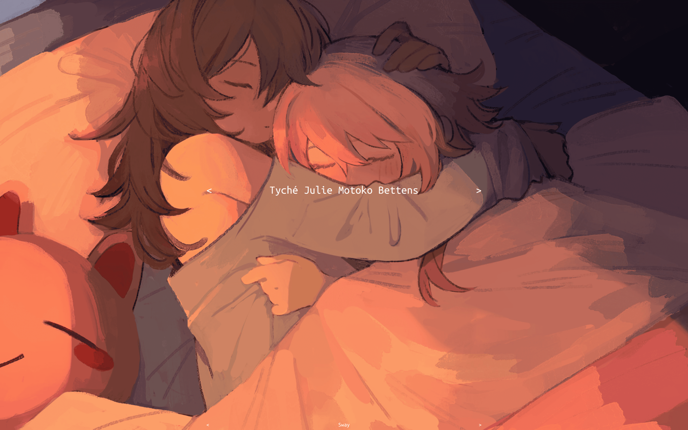
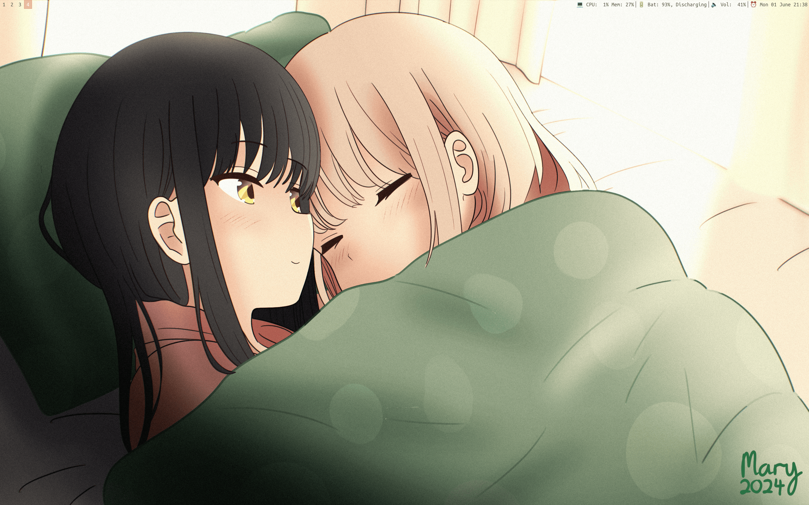

# SwayBian Theme

A minimalist theme for Sway/i3 and SDDM.




## Credits

* ["Sleepy No 2" by Mary](https://icosahedron.website/@mary/112666968268244432)

* ["have a cozy #starch morning" by byun](https://bsky.app/profile/arlecchumi.bsky.social/post/3l6se6bv7io2i)

* ["Where is my SDDM theme?" by Stepan Zubkov](https://github.com/stepanzubkov/where-is-my-sddm-theme)

## Installation

In your home-manager profile:

```nix
{ config, inputs, ...}: {
  imports = [ inputs.swaybian-theme.homeModules.default ];

  # we show sway but i3 is handled the same way
  themes.swaybian.sway.enable = true;

  # bars need to be handled explicitly
  wayland.windowManager.sway.config.bars = [
    {
      # ...
      inherit (inputs.swaybian-theme.lib.bars) colors;
    }
  ];

  # for i3 only, you also need to set the background picture using your prefered method (e.g. feh)
  xsession.windowManager.i3.config = {
    startup = [
      {command = "feh --bg-scale ${config.lib.swaybian-theme.art.sleepy_no2}";}
    ];
  };
}
```

In your NixOS profile:

```nix
{
  imports = [ inputs.swaybian-theme.homeModules.default ];

  themes.swaybian.sddm.enable = true;
```

Read [the upstream documentation](https://github.com/stepanzubkov/where-is-my-sddm-theme#keymaps) to find out the keybindings.

## FAQ

### Does it work on Debian?

The Sway and i3 modules probably work with home-manager. For SDDM we can probably hack something with system-manager.

### Is it Swabian?

No, but I'm sure it will be very popular at GPN24!

### Meow?

Meow!
